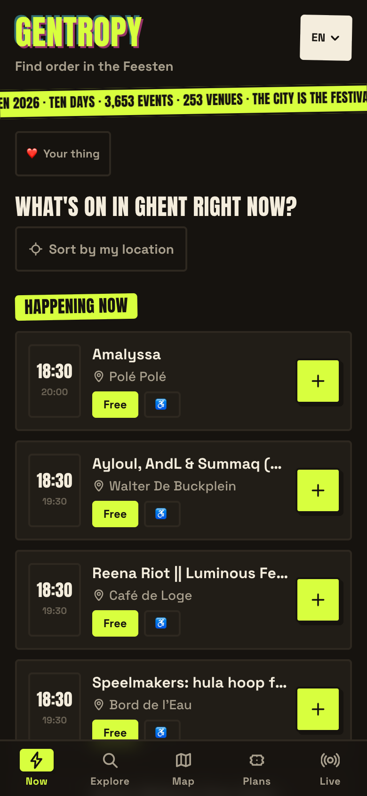
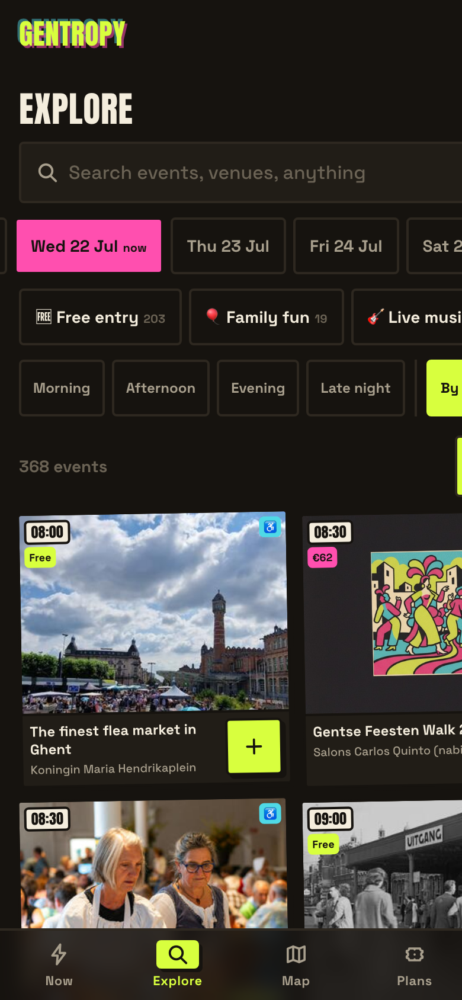
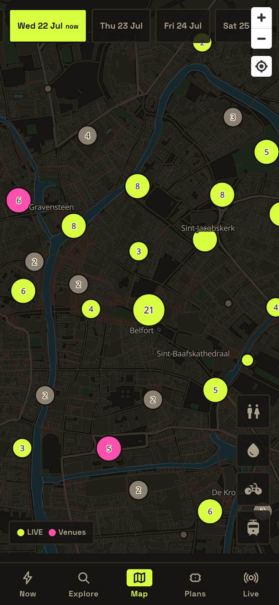

# Shu-Min (Allen) Kao

I work in bioinformatics and build software on the side. Based in Ghent, Belgium.

---

## Gentropy

**Find order in the Feesten.**

A mobile planner for Gentse Feesten 2026: ten days, 3,653 events, 253 venues, one city.

### [gentropy.vercel.app](https://gentropy.vercel.app)

 

<table>
  <tr>
    <td align="center"></td>
    <td align="center"></td>
    <td align="center"></td>
  </tr>
  <tr>
    <td align="center"><b>Now</b> A live feed of what plays this minute, sorted by your location</td>
    <td align="center"><b>Explore</b> Every event, filterable by day, theme, and time of day</td>
    <td align="center"><b>Map</b> Live sets and venues on a dark city map, plus toilets, water, and bike parking</td>
  </tr>
</table>

 

Built with Next.js, Supabase, and MapLibre. Available in six languages. Shared plans let friends vote on where to go next.

---

More projects in the workshop. Reach me on LinkedIn.

