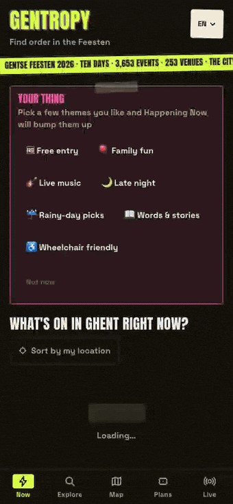

# Shu-Min (Allen) Kao

I work in bioinformatics and build software on the side.
Ghent, Belgium

## Projects

<table>
  <tr>
    <td width="360" align="center">
      
    </td>
    <td valign="top">
      <h3><a href="https://gentropy.vercel.app">Gentropy</a></h3>
      <em>Find order in the Feesten.</em>
      
Mobile planner for Gentse Feesten 2026: ten days, 3,653 events, 253 venues, one city.

      <ul>
        <li>Live feed of what plays this minute, sorted by your location</li>
        <li>Every event filterable by day, theme, and time of day</li>
        <li>Dark city map with live sets, venues, toilets, water, and bike parking</li>
        <li>Shared plans so friends can vote on where to go next</li>
      </ul>
      
Next.js · Supabase · MapLibre · six languages

      
<a href="https://gentropy.vercel.app"><b>Open the live app →</b></a>

    </td>
  </tr>
  <!-- Template for the next project: copy this row and fill it in.
  <tr>
    <td width="360" align="center">
      
    </td>
    <td valign="top">
      <h3><a href="https://LIVE-URL">NAME</a></h3>
      <em>Tagline.</em>
      
One-paragraph description.

      <ul>
        <li>Feature</li>
      </ul>
      
Stack

      
<a href="https://LIVE-URL"><b>Open the live app →</b></a>

    </td>
  </tr>
  -->
</table>

More projects on the way.

