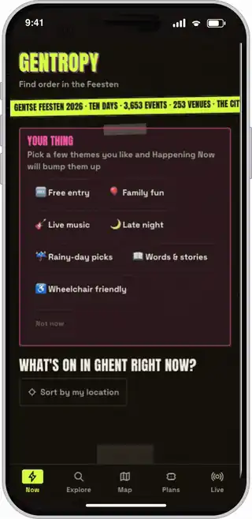
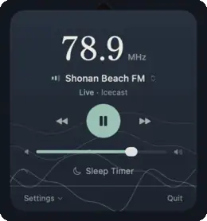
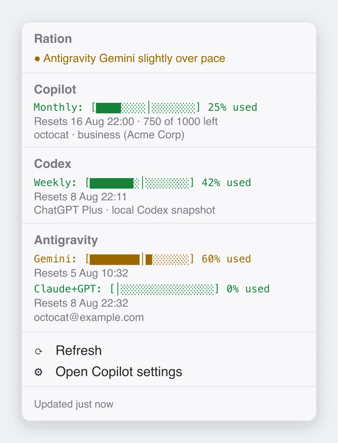
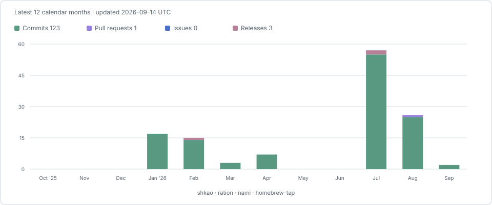

# Shu-Min (Allen) Kao

**Bioinformatics scientist and software engineer.**

I build data platforms for biomedical research by day, and ship small, fast apps by night.

Ghent, Belgium · [LinkedIn](https://www.linkedin.com/in/allenkao/)

## Projects

<table>
<tr>
<td width="360" align="center">
<picture>
<source media="(prefers-color-scheme: dark)" srcset="assets/gentropy-demo-dark.webp">

</picture>
</td>
<td valign="top">
<h3><a href="https://gentropy.vercel.app">Gentropy</a></h3>
<em>Find order in Gent.</em>

A mobile-first companion to Ghent, covering year-round events and local news plus a dedicated Gentse Feesten mode.

<ul>
<li>See what's happening now, what's coming up, and the latest local headlines</li>
<li>Browse the city agenda and the Gentse Feesten programme by date, theme, and time</li>
<li>Explore the city map for venues, toilets, water, and bike parking</li>
<li>Shared plans so friends can vote on where to go next</li>
</ul>

Next.js · Supabase · MapLibre · six languages

<a href="https://gentropy.vercel.app"><b>Open live app →</b></a>

</td>
</tr>
<tr>
<td width="360" align="center">

</td>
<td valign="top">
<h3><a href="https://github.com/shkao/Nami">Nami 波</a></h3>
<em>Tune in to the Shonan coast.</em>

A macOS menu bar app for hyper-local Japanese community FM, built so a station is one click away and stays there.

<ul>
<li>Live Japanese community FM from the menu bar</li>
<li>Auto-reconnects when the stream drops</li>
<li>Zero dependencies, CI on every commit</li>
<li>Ships at ~30 MB</li>
</ul>

SwiftUI · AVFoundation

<a href="https://github.com/shkao/Nami"><b>View on GitHub →</b></a>

</td>
</tr>
<tr>
<td width="360" align="center">
<picture>
<source media="(prefers-color-scheme: dark)" srcset="assets/ration-dark.webp">

</picture>
</td>
<td valign="top">
<h3><a href="https://github.com/shkao/ration">Ration</a></h3>
<em>Make it last to reset day.</em>

A macOS menu bar tracker for the AI quota your company rations you. One glance shows whether Copilot, Codex, and Antigravity will last until reset.

<ul>
<li>Live percent-used in the menu bar, busiest quota first</li>
<li>A pace tick on every bar: ahead of the clock, or behind</li>
<li>Warns in orange, then red, before you run out</li>
<li>Auto-detects Copilot, Codex, and Antigravity; keeps Copilot visible offline</li>
</ul>

SwiftBar · Bash · gh · jq

<a href="https://github.com/shkao/ration"><b>View on GitHub →</b></a>

</td>
</tr>
<!--
Template for the next project: copy a row and fill it in.
<tr>
<td width="360" align="center">

</td>
<td valign="top">
<h3><a href="https://LIVE-URL">NAME</a></h3>
<em>Tagline.</em>

One-paragraph description.

<ul>
<li>Feature</li>
</ul>

Stack

<a href="https://LIVE-URL"><b>Open live app →</b></a>

</td>
</tr>
-->
</table>

## Open source

Fixes I've shipped upstream, in other people's repositories.

<!-- open-source starts -->
<table>
<tr>
<td valign="top" width="230"><b><a href="https://github.com/companion-inc/feynman">feynman</a></b> · ★ 8.5k AI research agent for scientists</td>
<td valign="top">Concurrent PubMed lookups were tripping NCBI's E-utilities rate limit mid-search. Diagnosed it, then routed every caller through a shared pacing queue with a regression test and a burst-check script. <a href="https://github.com/companion-inc/feynman/issues/237">issue #237</a> · <a href="https://github.com/companion-inc/feynman/commits?author=shkao">3 commits</a> · <a href="https://github.com/companion-inc/feynman/pull/239">merged in #239</a></td>
</tr>
</table>
<!-- open-source ends -->

## Activity

## Now building

<!-- now-building starts -->
- Heads-down in private repos right now.
<!-- now-building ends -->

The activity chart, the open-source table, and this section refresh weekly via a [GitHub Action](.github/workflows/now-building.yml). Public repositories only.
