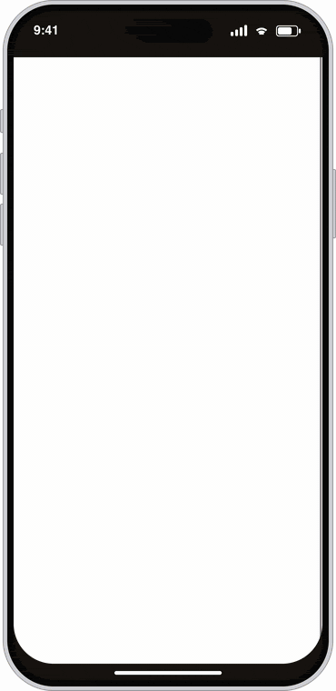
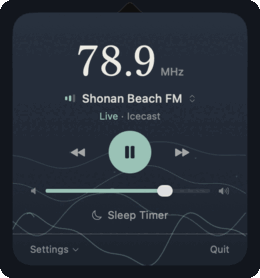
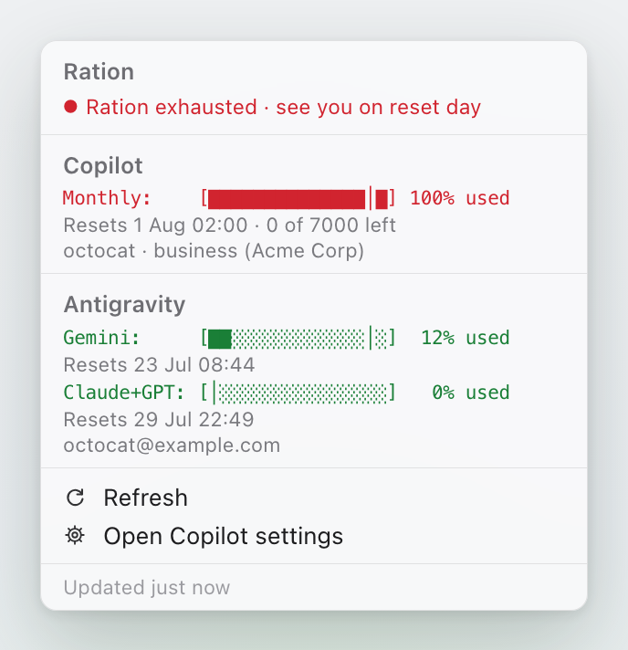

# Shu-Min (Allen) Kao

Bioinformatics scientist and software engineer by day, indie builder by night.
Ghent, Belgium · [LinkedIn](https://www.linkedin.com/in/allenkao/)

## Projects

<table>
  <tr>
    <td width="360" align="center">
      <picture>
        <source media="(prefers-color-scheme: dark)" srcset="assets/gentropy-demo-dark-v10.gif">
        
      </picture>
    </td>
    <td valign="top">
      <h3><a href="https://gentropy.vercel.app">Gentropy</a></h3>
      <em>Find order in Gent.</em>
      
A mobile-first companion for Ghent, with year-round events and local news plus a dedicated Gentse Feesten mode.

      <ul>
        <li>See what's happening now, what's coming up, and the latest local headlines</li>
        <li>Browse the city agenda and Gentse Feesten programme by date, theme, and time</li>
        <li>Explore the city map with venues, toilets, water, and bike parking</li>
        <li>Shared plans so friends can vote on where to go next</li>
      </ul>
      
Next.js · Supabase · MapLibre · six languages

      
<a href="https://gentropy.vercel.app"><b>Open the live app →</b></a>

    </td>
  </tr>
  <tr>
    <td width="360" align="center">
      
    </td>
    <td valign="top">
      <h3><a href="https://github.com/shkao/Nami">Nami 波</a></h3>
      <em>Tune in to the Shonan coast.</em>
      
A macOS menu bar app for five hyper-local community FM stations along Japan's Shonan coast: surf reports from Shonan, temple bells from Kamakura. It streams, reconnects, and keeps itself honest.

      <ul>
        <li>One click to play five community FM stations from the menu bar</li>
        <li>Auto-reconnect with backoff through stream, network, and sleep drops</li>
        <li>A daily CI health check that catches a dead stream before you do</li>
        <li>Hamonshu wave animation, bundled Shippori Mincho, ~30 MB</li>
      </ul>
      
SwiftUI · AVFoundation · zero dependencies

      
<a href="https://github.com/shkao/Nami"><b>View on GitHub →</b></a>

    </td>
  </tr>
  <tr>
    <td width="360" align="center">
      <picture>
        <source media="(prefers-color-scheme: dark)" srcset="assets/ration-dark.png">
        
      </picture>
    </td>
    <td valign="top">
      <h3><a href="https://github.com/shkao/ration">Ration</a></h3>
      <em>Make it last to reset day.</em>
      
A macOS menu bar tracker for the AI quota your company rations you. One glance shows whether Copilot, Codex, and Antigravity will last until they reset.

      <ul>
        <li>Live percent-used in the menu bar, busiest quota first</li>
        <li>A pace tick on every bar: ahead of the clock, or behind</li>
        <li>Warns in orange, then red, before you run out</li>
        <li>Auto-detects Copilot, Codex, and Antigravity; keeps Copilot visible offline</li>
      </ul>
      
SwiftBar · Bash · gh · jq

      
<a href="https://github.com/shkao/ration"><b>View on GitHub →</b></a>

    </td>
  </tr>
  <!-- Template for the next project: copy this row and fill it in.
  <tr>
    <td width="360" align="center">
      
    </td>
    <td valign="top">
      <h3><a href="https://LIVE-URL">NAME</a></h3>
      <em>Tagline.</em>
      
One-paragraph description.

      <ul>
        <li>Feature</li>
      </ul>
      
Stack

      
<a href="https://LIVE-URL"><b>Open the live app →</b></a>

    </td>
  </tr>
  -->
</table>

## Open-source activity

### Personal contributions

<!-- personal-activity starts -->
<a href="https://github.com/shkao">
  <picture>
    <source media="(prefers-color-scheme: dark)" srcset="https://github-readme-activity-graph.vercel.app/graph?username=shkao&amp;from=2026-07-04&amp;to=2026-08-03&amp;custom_title=Jul%204%20%E2%80%93%20Aug%203%2C%202026&amp;hide_border=true&amp;area=true&amp;bg_color=0d1117&amp;color=c9d1d9&amp;line=599981&amp;point=599981&amp;area_color=599981">
    
  </picture>
</a>
<!-- personal-activity ends -->

### Public project activity

## Now building

<!-- now-building starts -->
- Heads-down in private repos right now.
<!-- now-building ends -->

Refreshed weekly by a [GitHub Action](.github/workflows/now-building.yml). Public repos only.
